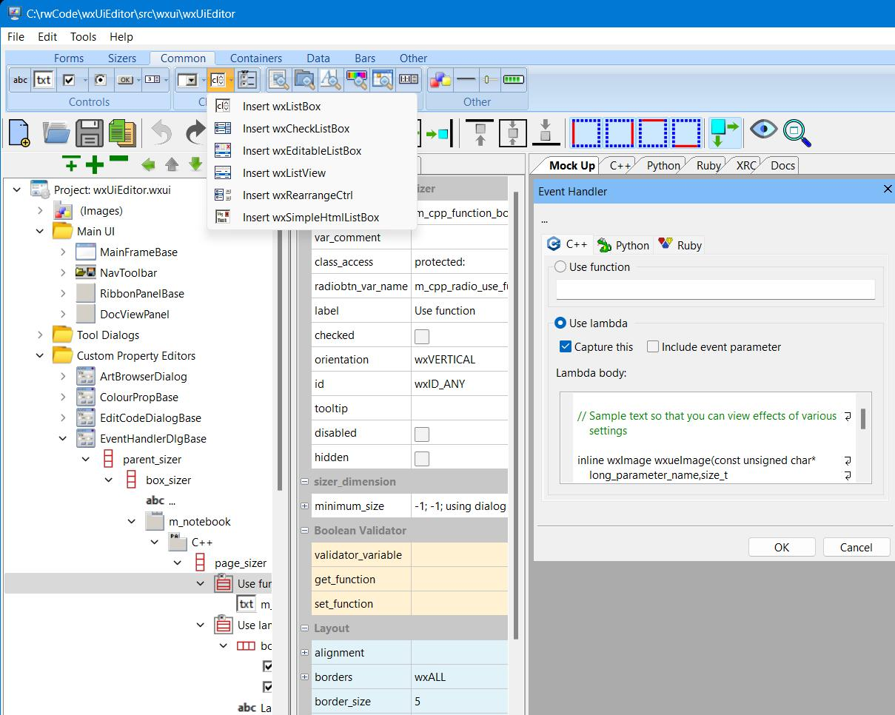

#  wxUiEditor

This Windows GUI tool is used to create and maintain [wxWidgets](https://docs.wxwidgets.org/trunk/index.html) UI elements (dialogs, menus, etc.), generating C++ output code. Minimal requirement for compiling output files is a c++11 compliant compiler and **wxWidgets** 3.0 (version 3.1 needed for full functionality).

In addition to creating new projects, the following project types can be imported:

- **wxFormBuilder** (Click [here](docs/import_formbuilder.md) for more information)
- **wxGlade**
- **wxSmith**
- **XRC** (including exports from **DialogBlocks**)
- **Windows Resource Dialogs** (Click [here](docs/import_winres.md) for more information)

## Building

Currently, you will need wxWidgets 3.15 installed somewhere with the `wx/` directory in your $INCLUDE environment variable, and a path to the wxWidgets libraries in your $LIB environment variable. Note that the Debug build uses the wxWidgets dlls, but the Release build expects static libraries. Currently, it's not possible to use vcpkg for the Release build because it also requires static versions of the CRT.

The easiest way to build the libraries is to run the following commands:

```
    cmake -G "Ninja Multi-Config" . -B build
    cmake.exe --build build --config Release
```

See [Developer notes](docs/DEV_NOTES.md) for more information about the code.

## Licenses

All KeyWorks Software code uses the Apache License 2.0 [LICENSE](LICENSE).

The pugixml code uses the MIT [LICENSE](pugixml/LICENSE.md).

## Screen shots

The following is a screen shot of **wxUiEditor** being used to edit one of it's own dialogs:



The following is a screen shot of the code that wxUiEditor would generate for the same dialog:


